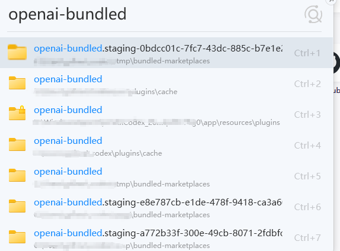
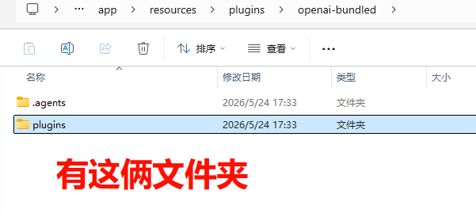
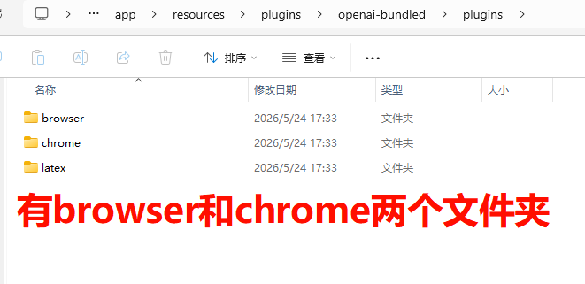
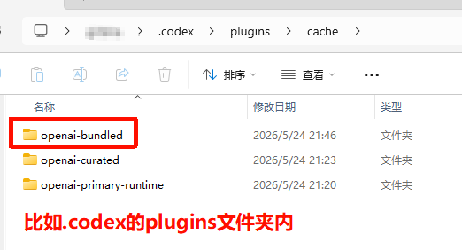
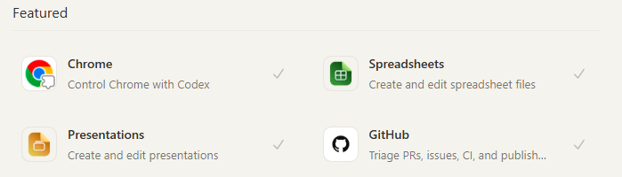
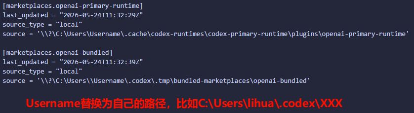
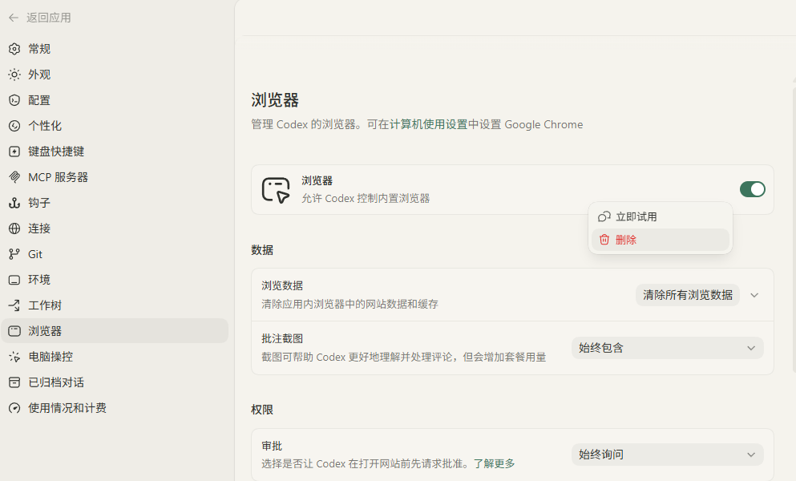
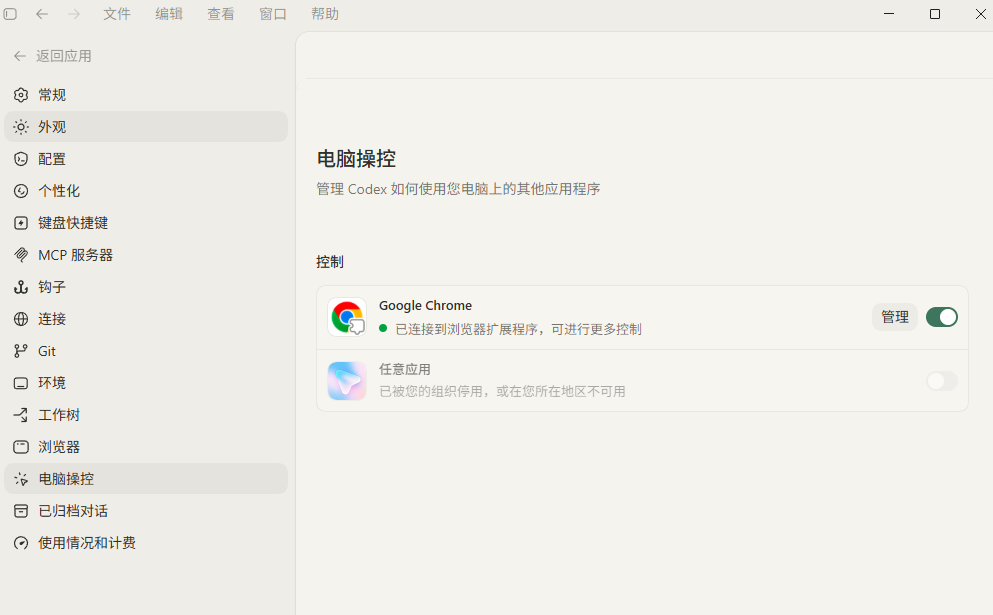

# Codex Chrome / Browser Plugin Fix

> [??](README.zh-CN.md) | English

## Problem

On some work devices, the latest **Chrome** and **Browser** plugins are not showing up in Codex, preventing browser automation.

## Solution Overview

Manually copy the `openai-bundled` plugin files and configure a local marketplace in `config.toml`.

---

## Steps

### Step 1: Locate the `openai-bundled` folder

Use **Everything** or **Listary** to search for `openai-bundled` on your Windows machine. You will find a folder inside `WindowsApps`:



Inside, there are `.agents` and `plugins` folders:



The `plugins` folder contains `browser`, `chrome`, etc.:



### Step 2: Copy `openai-bundled` to a custom path

Copy the entire `openai-bundled` folder to your desired location, e.g. `C:\Users\<Username>\.codex\plugins\cache\`:


Confirm the destination:



### Step 3: Edit `config.toml`

Add or update the `[marketplaces.openai-bundled]` section:

```toml
[marketplaces.openai-bundled]
last_updated = "2026-05-24T11:32:39Z"
source_type = "local"
source = "\\\\?\\C:\\Users\\<Username>\\.codex\\.tmp\\bundled-marketplaces\\openai-bundled"
```

> Replace `<Username>` with your Windows username.

Example:



### Step 4: Restart Codex

Fully close and restart Codex. The Chrome and Browser plugins should now appear:



### Step 5: Enable the plugins

Enable the **Browser** plugin in Settings:



Confirm **Google Chrome** is connected under Computer Control:



---

## Configuration Reference

```toml
[marketplaces.openai-bundled]
last_updated = "2026-05-24T11:32:39Z"
source_type = "local"
source = "\\\\?\\C:\\Users\\<Username>\\.codex\\.tmp\\bundled-marketplaces\\openai-bundled"
```

---

## Notes

- Ensure the copied `openai-bundled` contains both `.agents` and `plugins`.
- If plugins still do not appear, double-check the path or re-copy the files.
